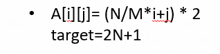
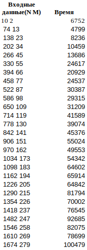
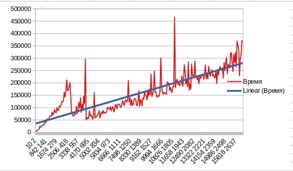
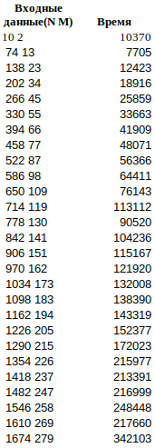
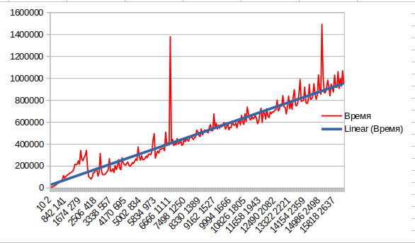

Поиск в матрице 
1) Решение за O(n + m).

В данном случае мы начинаем поиск из правого верхнего угла и движемся либо вниз, либо влево. Если текущий элемент меньше чем наш искомый элемент, то двигаемся вниз. Если больше, то двигаемся на одну клетку влево.
Полученные данные.

Создание матрицы

Полученные данные.

2) Решение за O(n⋅log(m))

В этом алгоритме проходимся по строкам, выполняя бинарный поиск. В данном случае лучше проходиться по строкам, потому что M <= N.

Уже на 2 алгоритме видно прирост времени получается, что O(n + m) < O(n*log(m))
Но по данным также видно менее заметное колебание графика.

3) third

Вывод: