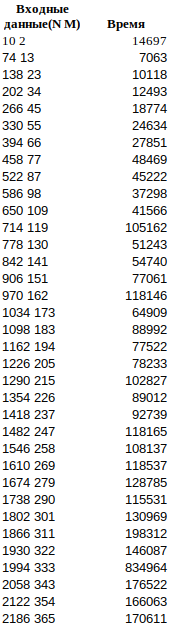
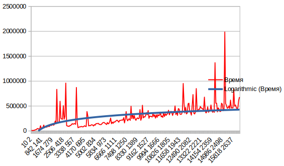
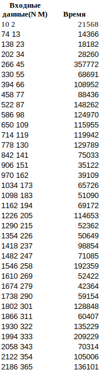
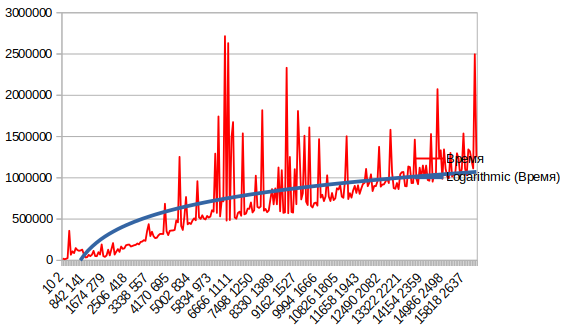
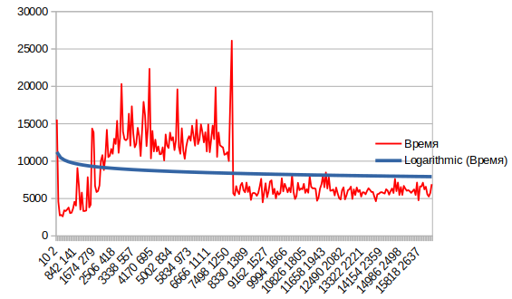
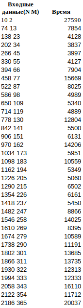
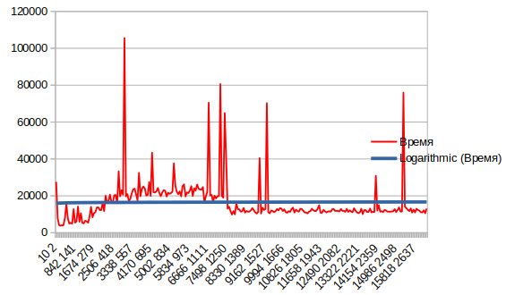
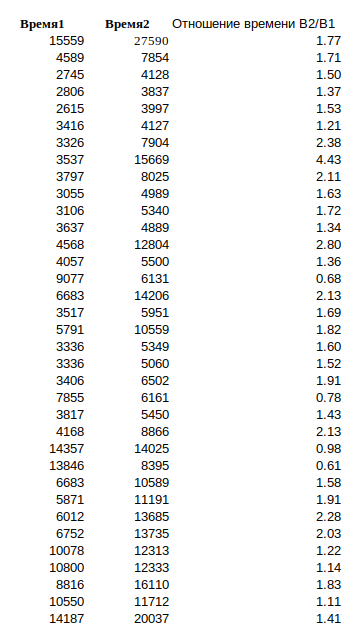

Поиск в матрице (java, IntelliJ IDEA)
1) Решение за O(n + m).

В данном случае мы начинаем поиск из правого верхнего угла и движемся либо вниз, либо влево. Если текущий элемент меньше чем наш искомый элемент, то двигаемся вниз. Если больше, то двигаемся на одну клетку влево.

Создание матрицы и заполнение matrix[i][j] = (N / M * i + j) * 2;

Полученные данные в ходе выполнения 1 алгоритма.

Создание матрицы и заполнение matrix[i][j] = (N / M * i * j) * 2;;

Полученные данные.

Со вторыми данными получилось, что время меньше, чем с первыми.

2) Решение за O(m⋅log(n))

В этом алгоритме проходимся по строкам, выполняя бинарный поиск. В данном случае лучше проходиться по строкам, потому что M <= N.

Создание матрицы и заполнение matrix[i][j] = (N / M * i + j) * 2;

Полученные данные.

Уже на 2 алгоритме видно прирост времени получается, что O(n + m) < O(m*log(n))
Но по данным также видно менее заметное колебание графика.

Создание матрицы и заполнение matrix[i][j] = (N / M * i * j) * 2;

Полученные данные.

Заполняя матрицы вторым вариантом, получили, что появились колебания.

3) Решение за O(m(log(n) - log(m) + 1)) 

В этом алгоритме, находим промежуток строк, где может находиться число, после для каждой строки нужно запустить экспоненциальный поиск.
На первом этапе определяется диапазон, в котором находился бы ключ поиска, если бы он был в списке. На втором этапе выполняется бинарный поиск по этому диапазону.

Создание матрицы и заполнение matrix[i][j] = (N / M * i + j) * 2;

Полученные данные.

Создание матрицы и заполнение matrix[i][j] = (N / M * i * j) * 2;

Полученные данные.

Сравнивая полученные данные на начальных значениях, получаем следующие отношения 

Вывод:
В ходе выполнения лабораторной работы было реализованно 3 алгоритма поиска элемента в отсортированной матрице.
Для каждого алгоритма была создана матрица, которая была заполнена, данными, двумя способами.

Коротко подведём итоги для каждого алгоритма.
1) поиск элемента с продвижением влево, вниз
    В результате получили в среднем одинаковые результаты, расхождения были, но не всегда, в целом алгоритм работает стабильно, 
    что на больших данных, что на малых.
2) поиск элемента с использованием бинарного поиска
    В ходе выполнения второго алгоритма, получили данные, которые показали, что 2 алгоритм работает дольше чем первый.
    Но в графике присутствуют довольно значительные колебания. 
3) поиск элемента с использованием экспоненциального поиска
    Третий алгоритм хорошо работает на больших данный, можно заметить по колебанию графиков.
    На небольших данных, менее эффективен.

Можно сказать, что для начала решения задачи поиска элемента в матрице, нужно определить с какими данными мы работаем, 
Каждый алгоритм будет работать эффективно в определённых условиях. Бинарный поиск и экспоненциальный поиск алгоритм лучше использовать, если работаем 
с большим диапазоном данных. Первый алгоритм тоже допустим и отработает, но уже с большим временем выполнения.
Его лучше использовать для среднего диапазона данных. Экспоненциальный поиск работает лучше, чем двоичный поиск, когда искомый элемент находится ближе к началу массива. На практике лучше использовать экспоненциальный поиск, потому что это один из эффективных алгоритмов поиска для неограниченных массивов.
