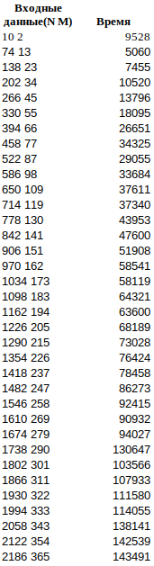
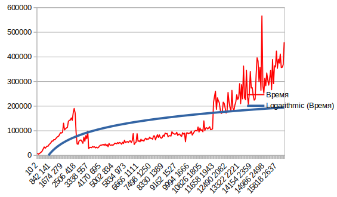
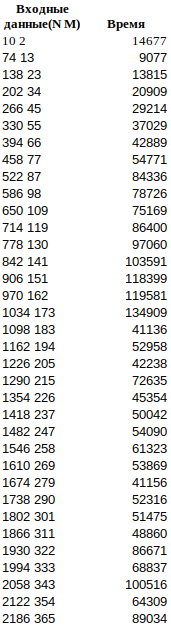
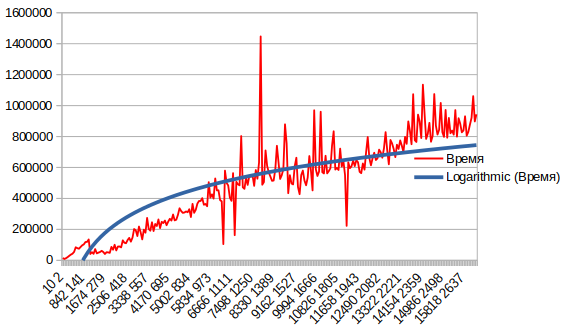
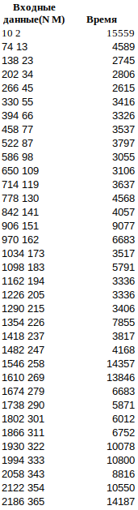

Поиск в матрице (java, IntelliJ IDEA)
1) Решение за O(n + m).

В данном случае мы начинаем поиск из правого верхнего угла и движемся либо вниз, либо влево. Если текущий элемент меньше чем наш искомый элемент, то двигаемся вниз. Если больше, то двигаемся на одну клетку влево.

Создание матрицы и заполнение matrix[i][j] = (N / M * i + j) * 2;

Полученные данные в хде выполнения 1 алгоритма.

Создание матрицы и заполнение matrix[i][j] = (N / M * i * j) * 2;;

Полученные данные.

Со вторыми данными получилось, что время меньше, чем с первыми.

2) Решение за O(m⋅log(n))

В этом алгоритме проходимся по строкам, выполняя бинарный поиск. В данном случае лучше проходиться по строкам, потому что M <= N.

Создание матрицы и заполнение matrix[i][j] = (N / M * i + j) * 2;

Полученные данные.

Уже на 2 алгоритме видно прирост времени получается, что O(n + m) < O(m*log(n))
Но по данным также видно менее заметное колебание графика.

Создание матрицы и заполнение matrix[i][j] = (N / M * i * j) * 2;

Полученные данные.

3) Решение за O(m(log(n) - log(m) + 1)) 

Создание матрицы и заполнение matrix[i][j] = (N / M * i + j) * 2;

Полученные данные.

Создание матрицы и заполнение matrix[i][j] = (N / M * i * j) * 2;

Полученные данные.

Вывод:
В ходе выполнения лабораторной работы было реализованно 3 алгоритма поиска элемента в отсортированной матрице.
1) поиск элемента с продвижением влево, вниз
2) поиск элемента с использованием бинарного поиска
3) поиск элемента с использованием экспоненциального поиска
Были получены следующие результаты:

