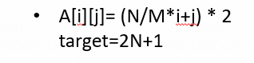

Поиск в матрице 
1) Решение за O(n + m).

В данном случае мы начинаем поиск из правого верхнего угла и движемся либо вниз, либо влево. Если текущий элемент меньше чем наш искомый элемент, то двигаемся вниз. Если больше, то двигаемся на одну клетку влево.
Полученные данные.

Полученные данные.

2) Решение за O(n⋅log(m))

3) third

Вывод: