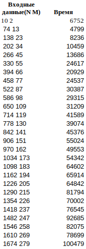
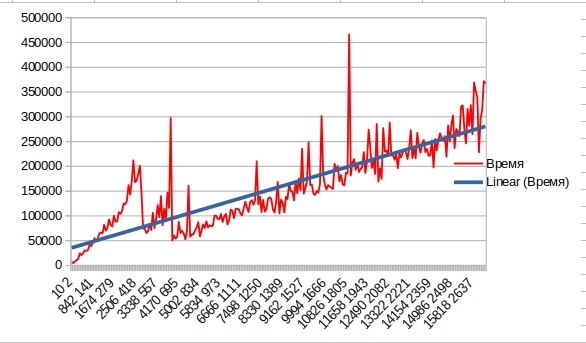
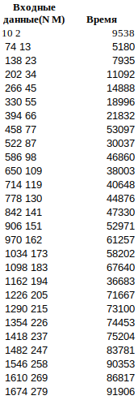
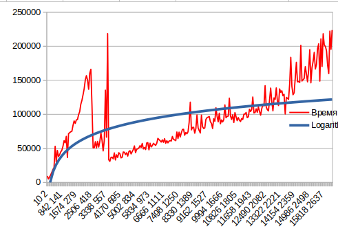
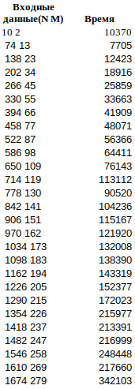

Поиск в матрице (java, IntelliJ IDEA)
1) Решение за O(n + m).

В данном случае мы начинаем поиск из правого верхнего угла и движемся либо вниз, либо влево. Если текущий элемент меньше чем наш искомый элемент, то двигаемся вниз. Если больше, то двигаемся на одну клетку влево.
Полученные данные.

Создание матрицы matrix[i][j] = (N / M * i + j) * 2;

Полученные данные.

Создание матрицы matrix[i][j] = (N / M * i * j) * 2;;

Полученные данные.

2) Решение за O(n⋅log(m))

В этом алгоритме проходимся по строкам, выполняя бинарный поиск. В данном случае лучше проходиться по строкам, потому что M <= N.

оздание матрицы matrix[i][j] = (N / M * i + j) * 2;

Полученные данные.

Уже на 2 алгоритме видно прирост времени получается, что O(n + m) < O(n*log(m))
Но по данным также видно менее заметное колебание графика.

Создание матрицы matrix[i][j] = (N / M * i * j) * 2;;

Полученные данные.

3) third

оздание матрицы matrix[i][j] = (N / M * i + j) * 2;

Полученные данные.

Создание матрицы matrix[i][j] = (N / M * i * j) * 2;;

Полученные данные.

Вывод: